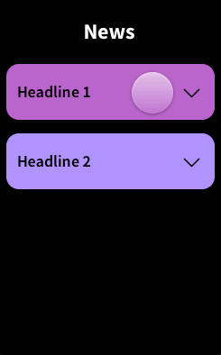

# Dynamic Stack

Framer X code component that acts as an alternative to the `Stack` component where items can be dyanmicaly hidden via code overrides.

## Installation

Install [this package](https://store.framer.com/package/jmargenberg-ovo/dynamic-stack) from the Framer X store.

## Usage

1. Connect DynamicStack to items.
2. Override the `visibleItems` prop to control which items are shown.
3. Preview the dynamic stack.

## Props

| Prop           | Type                | Description                                                           |
| -------------- | ------------------- | --------------------------------------------------------------------- |
| `items`        | `React.Component[]` | The frames to be displayed in the stack                               |
| `visibleItems` | `boolean[]`         | Controls which `items` will be displayed in the stack                 |
| `scrollable`   | `boolean`           | If true, makes the stack scrollable and hides any overflowing content |

## Property Controls

As well as exposing the above props, all the property controls of the `Stack` component have been replicated (except for `distribute`).

## Example Project

You can download an example project showing how to use this component [here](https://github.com/ourveryown/framer-x-dynamic-stack/blob/master/DyanmicStack.framerx).

